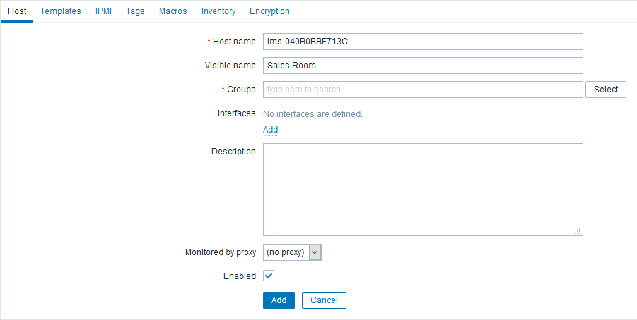
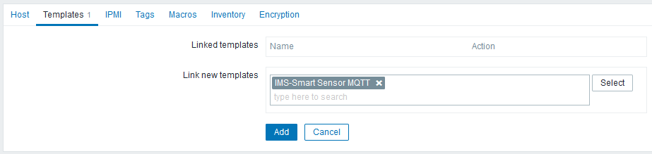
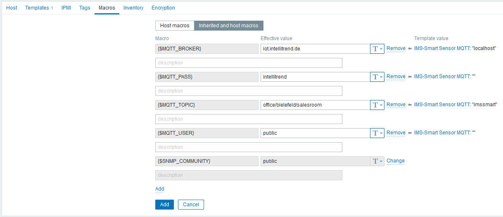

# Zabbix MQTT demo setup from Zabbix Summit 2020

For details about the Zabbix summit and the talk see [Zabbix Summit 2020](https://www.zabbix.com/events/zabbix_summit_2020) and [Let me subscribe - Zabbix masters IoT Topics](https://www.zabbix.com/events/zabbix_summit_2020_agenda#day1_10:50).

# About this repository

This repository contains instructions and templates that allows to test out the new MQTT feature added to Zabbix 5.2, with real sensor data provided by the IntelliTrend IoT demonstration MQTT broker.

## Required software

* Zabbix-Server: Version 5.2 or higher
* Zabbix-Agent 2: Version 5.2 or higher

## Sensors and MQTT topics

The demonstration setup consists of four [IMS-Smart sensors](https://www.intellitrend.de/cms/en/intellimon/ims-smart-sensors/5/ims-smart-zabbix-sensor) running a firmware with MQTT support. They publish their data every 10 minutes as a JSON-string to an MQTT Broker on `iot.intellitrend.de` using the following MQTT topics:

| Name          | Hostname         | Topic                         |
| ------------- | ---------------- | ----------------------------- |
| Sales Room    | ims-040B0BBF713C | office/bielefeld/salesroom    |
| Server Room   | ims-603E9BC40A24 | office/bielefeld/serverroom   |
| Training Room | ims-94B71112CFA4 | office/bielefeld/trainingroom |
| Support Room  | ims-54711212CFA4 | office/bielefeld/supportroom  |

A message may look like this:

```json
{
    "hasenv": 1,
    "hasiaq": 1,
    "hastempe": 0,
    "temp": 21.44,
    "hum": 40.06445,
    "dew": 7.749891,
    "press": 101449.7,
    "eco2": 1170,
    "tvoc": 117,
    "rssi": -52,
    "vcc": 4.069938,
    "batterycharge": 92.07,
    "serial": "54711212CFA4",
    "version": "1.6.2",
    "build": "4e13ef3b master / 2021-11-30 10:18:50",
    "enverror": 0,
    "iaqerror": 0,
    "iaqerrorstatus": 0,
    "iaqheatingtime": 1200,
    "iaqbaseline": 45960,
    "iaqdisabled": 0,
    "tempeerror": 0,
    "sfails": 0,
    "wfails": 0,
    "cfails": 0,
    "tfails": 0,
    "wctime": 1.257,
    "sctime": 0.059,
    "rreason": 5,
    "wareason": 4,
    "interval": 10,
    "location": "Support Room",
    "contact": "IntelliTrend Monitoring Team",
    "geolatitude": 52.01379,
    "geolongitude": 8.56564,
    "devicetype": "1",
    "otaconfigstatus": 0,
    "otafwstatus": 0
}
```

Here is an overview of the most important metrics:

| Name          | Purpose                                               |
| ------------- | ----------------------------------------------------- |
| temp          | Air temperature in degrees Celsius.                   |
| hum           | Air humidity in percent.                              |
| press         | Air pressure in Pascals.                              |
| dew           | Dew point in in degrees Celsius.                      |
| tempe         | Temperature of external probe in degrees Celsius.     |
| eco2          | Equivalent CO<sub>2</sub> in parts per million.       |
| tvoc          | Total volatile organic compound in parts per billion. |
| rssi          | WiFi signal strength in dBm.                          |
| vcc           | Battery voltage.                                      |
| batterycharge | Approximated battery charge level in percent.         |

In addition to these all-in-one messages, individual metrics are published on their own topics as well: `temp`, `hum`, `press`, `eco2` and `tvoc`.

Examples: 

- Only get the temperature of `Server Room`, use the topic: `  office/bielefeld/serverroom/temp`.
- Only get the humidity of `Training Room`, use the topic: `  office/bielefeld/trainingroom/hum`.

## How to setup

First, import the included template file [Zabbix_Template-IMS-Smart_Sensor_V1.6_5.2_MQTT.yaml](templates/Zabbix_Template-IMS-Smart_Sensor_V1.6_5.2_MQTT.yaml) 

Then create a new host. Starting with the first one, name it "Sales Room" and set `ims-040B0BBF713C` as Host name:



After that, switch to Templates and link it with the template `IMS-Smart Sensor MQTT`:



Then switch to Macros and fill out the fields with the credentials:

- `{$MQTT_BROKER}`: iot.intellitrend.de
- `{$MQTT_USER}`: public
- `{$MQTT_PASS}`: intellitrend
- `{$MQTT_TOPIC}`: office/bielefeld/salesroom

**Note:** This MQTT account allows to subscribe to the topic `office/bielefeld/#` , publishing of messages is not possible.



Finally, click "Add" to add the new host.

Now, you need to configure a Zabbix Agent 2 instance to allow active checks for that host, which is required for `mqtt.get`. For that, the `Hostname` property needs to be changed in the Zabbix Agent 2 config by adding `ims-040B0BBF713C`. If there's already a host name defined, separate the new one with a comma (multiple Hostnames is a new feature of the Zabbix Agent 2 in Zabbix 5.2).

For the remaining sensors, it's easiest to clone the first host and update the visible name, host name and topic.

If you're in a hurry, you can also just import all demonstration hosts by using the [Zabbix_Hosts-Sensors.yaml](templates/Zabbix_Hosts-Sensors.yaml) and set your `Hostname` property to `ims-040B0BBF713C,ims-603E9BC40A24,ims-94B71112CFA4,ims-54711212CFA4`.
